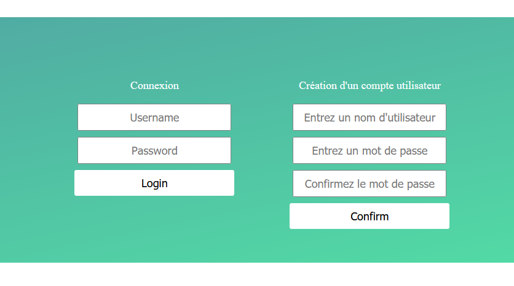

## Projet API (Groupe 31: Clément LE BAS)

##### Commande lancement de l'application :

* Serveur: mvnw spring-boot:run
* Navigateur: http://localhost:4000/api

Si le front ne s'affiche pas:
* Installer Node.js
* cmd: 
  * npm install 
  * npm run build
----

##### Détails navigation API login:

- GET /api

- GET /api/users

- POST /api/login

- POST /api/inscription

- POST /api/inscription (user already exist)

- GET /api/disconnect

##### Détails navigation API Sondage:

- GET /api/survey

- POST /api/survey/create

- GET /api/survey/mysurvey 

